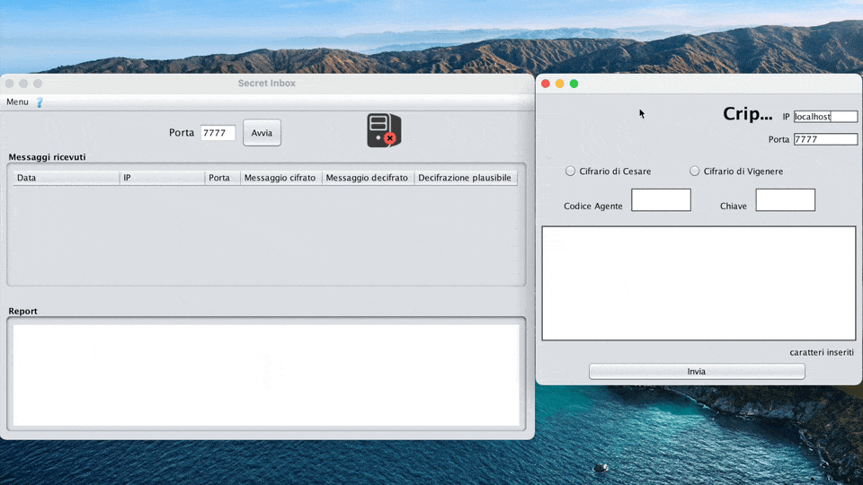

# Cipher Playground

The goal of this Java project provides a client/server system for sending and archiving encrypted messages using the Caesar and Vigenère ciphers. The received encrypted messages can also be decrypted without a key through brute force.

## Build and Run

To build and run the project, follow these steps:

1. Make sure you have Java 14 installed on your machine.
2. Clone this repository to your local machine.
3. Open IntelliJ IDEA and import each project: Cifrario_Server and Cifrario_Client as disticnt projects.
4. For each project use Java 14:
   1. Go to File > Project Structure.
   2. Under Project Settings, click on Project.
   3. Set the Project SDK to Java 14.
   4. Set the Project language level to 14.
   5. Click Apply and then OK.
5. Build the project by clicking on the Build button or using the shortcut key Ctrl + F9.
6. Run the server by running the Main class.

## Conclusion

This is a simple project that demonstrates how to implement a basic chat server capable of handling multiple chat rooms. With this readme, you should be able to build, run, and generate documentation for the project.